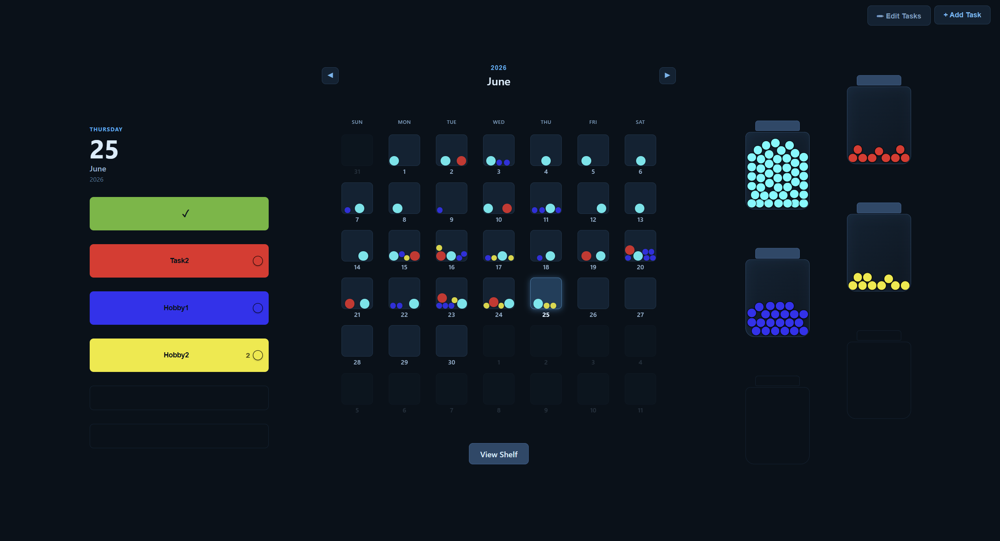

# Completion Calendar

[](package.json)
[](LICENSE.txt)
[](#installation--setup)

> A calendar and habit-tracker where finishing a task drops a physics-simulated ball into the day you did it — and into a jar that fills, celebrates, and empties as your streak grows.

Built for anyone who wants habit tracking to feel tactile instead of like a spreadsheet. Runs as a local web app or a packaged Windows desktop app. **Zero runtime dependencies** — no framework, no build step, no database, no accounts.



## Features

- **Tactile ball physics** — every completion drops a real ball into that day's box: gravity, bouncing, and ball-to-ball collision, settling into a pile.
- **Jars that celebrate** — each completion also flies into the task's jar. Hit 50 and it bursts with confetti, drains, and refills.
- **Shelf view** — all your jars lined up on shelves, one filled jar per completed batch — a physical-looking record of progress.
- **Year / month / day views** with an animated zoom transition between them (hand-rolled FLIP animation, no library).
- **Two task types** — *Completion* (once per day, ✓) and *Repeated* (log as many times a day as you want, with a per-day count).
- **Optimistic UI** — instant updates with automatic rollback if a write fails. Plus per-day undo, drag-to-reorder, and edit/recolor/delete.

## Installation

**Use the app (Windows):** download the latest `.exe` from [Releases](../../releases), install, and launch from your Start menu.

**Run from source (any OS with Node.js):**

```bash
git clone https://github.com/Braoden/CompletionCalendar.git
cd CompletionCalendar
node server.js
# open http://localhost:5577
```

That's it — the server is zero-dependency, so there's no `npm install` step to run the web app.

## Project structure

```
CompletionCalendar/
├── index.html   Calendar markup, modals, day/task panels
├── style.css    All styles (hand-written)
├── script.js    Front-end logic: calendar, ball physics, jars, shelf view
├── server.js    Zero-dependency HTTP server: static files + tasks/completions API
├── main.js      Electron entry point (loads the local server in a window)
└── package.json Scripts + electron-builder config
```

## Architecture overview

- **Front end** — a single `Calendar` ES6 class in `script.js` owns all UI: view switching, task editing, and a custom fixed-timestep 2D physics engine (gravity, restitution, ball-to-ball collision) rendered via `requestAnimationFrame`.
- **Back end** — `server.js` is a loopback (`127.0.0.1`) server built on Node's core `http` module. It serves the static files and a small REST API, and persists to flat JSON files written atomically (temp file + rename).
- **Desktop** — `main.js` boots the same local server and points an Electron `BrowserWindow` at it. The web app and desktop app run identical code.

**How the ball/jar mechanics work:** completing a task POSTs to `/api/completions/add`. The front end optimistically spawns a ball into the day's box and a ball into that task's jar; both are driven by the physics loop. When a jar reaches 50 it triggers the confetti burst and resets, recording a filled jar on the shelf.

## API documentation

All endpoints are served from `http://localhost:5577`.

| Method | Endpoint | Purpose |
|--------|----------|---------|
| `GET`  | `/api/tasks` | List tasks |
| `POST` | `/api/tasks` | Create a task |
| `PUT`  | `/api/tasks` | Replace the task list (used by drag-reorder) |
| `PATCH`| `/api/tasks` | Edit a task (rename / recolor) |
| `DELETE`| `/api/tasks` | Delete a task |
| `GET`  | `/api/completions` | Get all completions |
| `POST` | `/api/completions/add` | Record a completion |
| `POST` | `/api/completions/remove` | Undo a completion |

## Tech stack

- **Front end** — Vanilla JavaScript (ES6 classes), hand-written HTML5 + CSS3, custom FLIP zoom animation, custom 2D physics engine.
- **Back end** — Node.js core `http` module (zero dependencies), JSON flat-file persistence.
- **Desktop packaging** — Electron + electron-builder (dev dependencies only).
